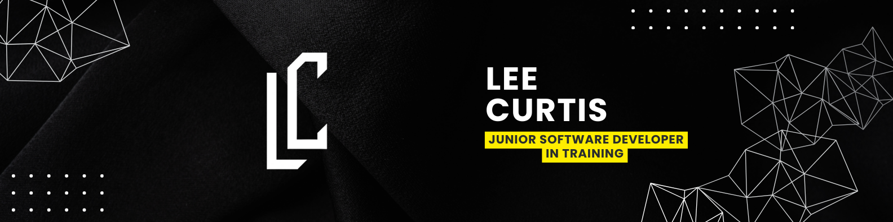

# Hi, I'm Lee 👋
### Aspiring C# Developer

**Retraining via Just IT Skills Bootcamp (Nov 2025 – Jan 2026)**

---

### 🧐 About Me

I am a Junior Developer in training, currently transitioning into the tech industry through an intensive bootcamp. I am focused on backend development with **C#** and **.NET**, but I am building a solid foundation in full-stack web technologies.

I am still trying to get to grips with git and github.

📍 **Location:** UK
💼 **Availability:** Open for Junior / Graduate / Apprenticeship roles starting **January 2026**.

---

### 🛠️ Tech Stack & Tools
*(Currently learning and applying)*

---

### 🚀 Bootcamp Roadmap (Updated Weekly)

I am documenting my code and progress weekly. Check the repositories pinned below to see my growth.

|   Week    | Focus Area                  | Status | Key Concepts                                     |
| :-------: | :-------------------------- | :----: | :----------------------------------------------- |
|  **01**   | **HTML5 & CSS3**            |   ✅    | Semantic layout, Grid, Flexbox, Responsive Forms |
|  **02**   | **JavaScript**              |   🚧    | DOM Manipulation, ES6+, Logic Fundamentals       |
| **03-08** | **C# & .NET**               |   📅    | OOP, Entity Framework, ASP.NET Core, SQL         |
| **Final** | **Final Portfolio Project** |   📅    | Full-stack Project Development                   |

---

  ### 🤝 Let's Connect!

  
  
  
  
P.S. Check out my pinned repos below to see live code and project demos 👇

